<h1 align="center">🧊 Cubito</h1>

<p align="center">
  <strong>A spatial frontend for ORCA's agent orchestration engine.</strong><br/>
  Your parallel coding agents, their worktrees and the system they are building, rendered as one navigable 3D scene.
</p>

<p align="center">
  <a href="https://github.com/tincke10/Cubito/actions/workflows/cubito-ci.yml"></a>
  
  
</p>

<p align="center">
  
</p>

---

## The improvement

[ORCA](https://github.com/stablyai/orca) already solves the hard part of multi-agent development: it fans one prompt across N coding agents, gives each its own git worktree, keeps the parent/child lineage, runs the terminals in a daemon that survives restarts, and coordinates the whole run through a SQLite-backed DAG. That engine is excellent.

What ORCA shows you is tabs, panes and lists. You *manage* the parallelism; you never *see* it.

Cubito keeps the engine and replaces the window. It runs `orcad`, ORCA's headless runtime, and talks to it over the same versioned WebSocket RPC the desktop app uses. On top of that it renders:

- **The worktree graph as a scene.** Every worktree is a node. Which worktree spawned which is an edge you can fly along, not metadata in a sidebar.
- **The fan-out as a litter.** Spawn five agents from a node and five branches grow in space. Gates and interactive questions from the run surface next to the node that raised them.
- **The result as a comparison.** Compare the children side by side, pick the winner, merge it into the parent headlessly, and optionally sync the parent's working tree in the same step.
- **The system as it is being built.** A live graph of routers, endpoints, services and databases parsed from the source in each worktree, with the uncommitted diff per file painted onto it as agents write code. Express, Fastify and NestJS are recognised today.
- **The terminal inside the world.** Each node carries its real PTY, streamed over RPC. The panel attaches to the agent's own terminal first and opens extra shells on demand.

Nothing about orchestration was reinvented. Every feature above is a view over data the engine already produces.

## What you get today

All of the following is shipped, covered by tests, and was validated against a running `orcad` before merging.

| Area | Capability |
|---|---|
| Graph | Worktree islands per repo, lineage edges, camera framing per island and per litter, keyboard navigation |
| Spawn | New worktree from any node, with or without a starting agent and prompt |
| Fan-out | One prompt across N children through a GUI run lease; per-child failure reason; gates and questions answered from the scene |
| Compare | Rail-of-rails view of the children, winner selection, headless merge into the parent, opt-in parent working-tree sync (only when the parent is clean) |
| Diff | File rail plus line panel for any worktree, rename-aware |
| System | Route, service and database graph for Express, Fastify and NestJS, including cross-file mount prefixes, `setGlobalPrefix` and `RouterModule.register`; pushed over a `system.watch` stream with a snapshot fallback for older hosts |
| Terminals | Multiple PTYs per worktree, agent terminal first, new shell with a keystroke |
| Agents | Trust pre-marked per worktree for Claude Code, Codex, Cursor and Copilot, so a starting agent lands on its prompt without a dialog; per-account `CLAUDE_CONFIG_DIR` and `CODEX_HOME` honoured, locally and over SSH |
| Compatibility | Capability negotiation on pairing: a newer Cubito degrades gracefully against an older `orcad`, and optional fields never break an older client |

The live system graph is the piece no other window offers: the source in each worktree, parsed into what it exposes and what it talks to, refreshed as the agents write.

<p align="center">
  
</p>

### Keys

| Key | Action |
|---|---|
| `h` `j` `k` `l` | navigate: parent, previous root, next root, child |
| `f` / `v` | focus the selection / fit everything |
| `s` | spawn menu |
| `Shift+F` | fan-out form |
| `g` | worktree graph |
| `x` | live system graph |
| `d` | diff |
| `c` | compare the litter |
| `t` / `Shift+T` | terminal panel / new shell |
| `⌘K` / `Ctrl+K` | command palette (projects, add repo, everything above) |
| `Esc` | close the current panel |

## Architecture

```
┌──────────────────────────────────────────────────────────┐
│                     Cubito frontend                      │
│  vanilla TypeScript · Three.js scene · SVG system graph  │
│  worktree graph · fan-out · compare · diff · terminals   │
└────────────────────────────┬─────────────────────────────┘
                             │ WebSocket RPC (versioned envelope,
                             │ capability-negotiated on pairing)
                             │ worktree.* · terminal.* · git.* ·
                             │ orchestration.* · system.* · agent.*
┌────────────────────────────┴─────────────────────────────┐
│                  orcad  (headless daemon)                 │
│        plain Node 24, zero Electron, CI-enforced          │
├──────────────┬───────────────┬───────────────────────────┤
│ git          │ PTY daemon    │ orchestration DAG (SQLite) │
│ worktrees +  │ node-pty,     │ coordinator · fan-out ·    │
│ lineage      │ restart-safe  │ gates · run leases         │
├──────────────┴───────────────┴───────────────────────────┤
│ system graph: source crawl + AST route parsers           │
│ (Express · Fastify · NestJS), service/db heuristics       │
└──────────────────────────────────────────────────────────┘
```

The frontend is a separate package under `frontend/`, with its own lockfile and test suite. The engine lives under `src/main/` and builds to a single bundle, `out/orcad/orcad.js`.

## Install it

Cubito is isolated by construction: it never touches an existing Orca install. It keeps its own data under `~/.cubito` and its own worktrees under `~/cubito/workspaces` — never `~/.orca` or `~/orca/workspaces` — so a machine can run both side by side.

### macOS

Requirements: Node 24, pnpm 10.24 (via corepack), git, and the Xcode Command Line Tools (`xcode-select --install`) — `node-pty` is compiled from source.

```bash
git clone https://github.com/tincke10/Cubito.git
cd Cubito
pnpm cubito:install   # preflights the toolchain, installs and builds engine + frontend, stages the web client
pnpm cubito:start      # boots orcad, which serves the frontend on the same port; prints the pairing URL and opens it
```

`cubito:install` fails fast with an actionable fix line for any missing prerequisite. `cubito:start` boots a single `orcad` process — no separate frontend server — and prints one URL, `http://127.0.0.1:6799/web-index.html#pairing=...`, once it's ready, opening it in your default browser. If you reload that tab, re-open the printed URL instead — a soft reload drops the pairing fragment and lands you in demo mode.

Override the defaults with flags or environment variables: `--data-dir` / `$ORCA_USER_DATA`, `--worktree-root` / `$CUBITO_WORKTREE_ROOT`, `--port` / `$CUBITO_ORCAD_PORT`, `--no-open` / `$CUBITO_NO_OPEN`. Running two Cubitos at once needs two different data dirs — pass a second `--data-dir` (and a free `--port`) for the second one.

**Developing the frontend**: `pnpm --dir frontend run dev` still runs its own Vite dev server on `5180` for hot reload, separate from the staged build `cubito:start` serves. `cubito:start` also prints a "dev frontend" URL carrying the same pairing fragment for that server.

### Docker

Requirement: Docker Desktop.

```bash
docker compose up --build   # or: pnpm cubito:docker
```

This builds the image and starts a `cubito` container publishing only `6799` — orcad serves the frontend on that same port — with data in the `cubito-data`, `cubito-workspaces` and `cubito-repos` named volumes. Watch the logs for the printed pairing URL and open it on the host at `http://localhost:6799/...`.

Coding agents run inside the container, so log them in there:

```bash
docker compose exec cubito claude login
```

Repos to work on live under `/repos` inside the container. Clone one in, then add it from the command palette (`⌘K` / `Ctrl+K`):

```bash
docker compose exec cubito git clone <url> /repos/<name>
```

A demo NestJS repo (`/repos/demo-nest`) is seeded and registered on first boot, so it's already visible in the UI — no `⌘K` needed for it.

To reset everything — data, worktrees and cloned repos:

```bash
docker compose down -v
```

## Verify

```bash
# engine
pnpm tc:node
pnpm test src/main/system-graph/system-graph-service-nest.test.ts   # one file
pnpm exec oxlint

# frontend
pnpm --dir frontend run typecheck
pnpm --dir frontend run test
pnpm --dir frontend run lint

# the fork's extraction test: builds orcad headless and runs a real terminal round trip
pnpm smoke:orcad-terminal
```

CI runs four gates on every push and pull request: the runtime stays Electron-free, `orcad` builds and passes the terminal smoke, the engine unit suite runs in eight shards, and the frontend suite runs in full. Guard tests keep the repository honest: every `package.json` script must point at files that exist, and `AGENTS.md` may not reference the removed desktop shell.

## Relationship with ORCA

Cubito is a fork of ORCA that keeps the engine and drops the desktop shell: the Electron main process, the React renderer, the preload bridge, the mobile apps and the relay are gone. Full upstream history is retained and the RPC surface is unchanged, so engine improvements from upstream remain mergeable.

Engine changes made here are additive and wire-compatible: new optional fields, new capability keys, new route parsers. A Cubito frontend paired with an upstream host that lacks a capability simply does not offer the feature.

## Credits

The orchestration engine, `orcad`, the worktree lineage model, the PTY daemon and the RPC surface are the work of Stably AI / Lovecast Inc. in [ORCA](https://github.com/stablyai/orca), MIT licensed. Cubito is a different window into that engine.

## License

[MIT](LICENSE). Original engine © Lovecast Inc.; Cubito modifications © Martín Moreira.
