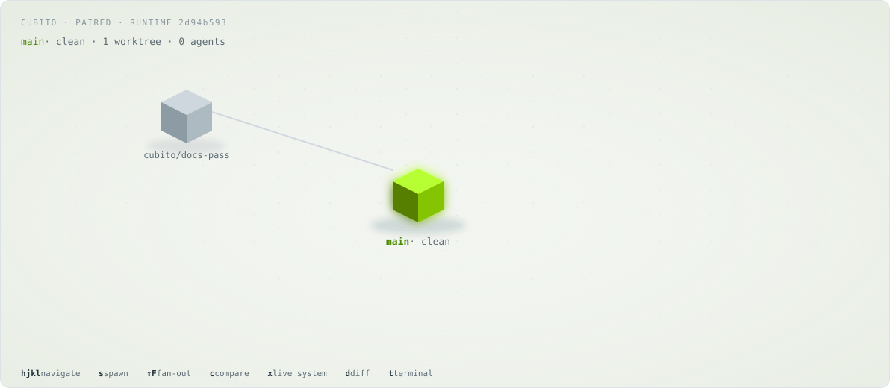
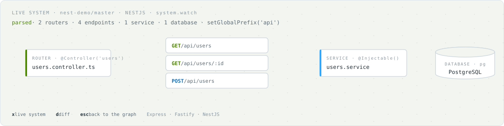

<h1 align="center">🧊 Cubito</h1>

<p align="center">
  <strong>A spatial frontend for ORCA's agent orchestration engine.</strong><br/>
  Your parallel coding agents, their worktrees and the system they are building, rendered as one navigable 3D scene.
</p>

<p align="center">
  <a href="https://github.com/tincke10/Cubito/actions/workflows/cubito-ci.yml"></a>
  <a href="https://github.com/tincke10/Cubito/releases"></a>
  
  
</p>

<p align="center">
  
</p>

---

## Quickstart

With Docker Desktop, using the published image (`ghcr.io/tincke10/cubito`, amd64 and arm64):

```bash
git clone https://github.com/tincke10/Cubito.git && cd Cubito
cp .env.example .env     # then edit: at least CLAUDE_CODE_OAUTH_TOKEN (from `claude setup-token`) and your git identity
docker compose up -d && docker compose logs cubito   # look for the "[cubito] open: http://127.0.0.1:6799/web-index.html#pairing=..." line
```

Open that URL on the host. Run `claude setup-token` on the host once; it opens the browser and prints the long-lived token agents use inside the container. Every variable `.env` accepts is listed in [Environment variables](#environment-variables). No Docker? See [macOS](#macos).

## The improvement

[ORCA](https://github.com/stablyai/orca) already solves the hard part of multi-agent development: it fans one prompt across N coding agents, gives each its own git worktree, keeps the parent/child lineage, runs the terminals in a daemon that survives restarts, and coordinates the whole run through a SQLite-backed DAG. That engine is excellent.

What ORCA shows you is tabs, panes and lists. You *manage* the parallelism; you never *see* it.

Cubito keeps the engine and replaces the window. It runs `orcad`, ORCA's headless runtime, and talks to it over the same versioned WebSocket RPC the desktop app uses. On top of that it renders:

- **The worktree graph as a scene.** Every worktree is a node. Which worktree spawned which is an edge you can fly along, not metadata in a sidebar.
- **The fan-out as a litter.** Spawn five agents from a node and five branches grow in space. Gates and interactive questions from the run surface next to the node that raised them.
- **The result as a comparison.** Compare the children side by side, pick the winner, merge it into the parent headlessly, and optionally sync the parent's working tree in the same step.
- **The system as it is being built.** A live graph of routers, endpoints, services and databases parsed from the source in each worktree, with the uncommitted diff per file painted onto it as agents write code. Express, Fastify, NestJS and Hono are recognised today.
- **The terminal inside the world.** Each node carries its real PTY, streamed over RPC. The panel attaches to the agent's own terminal first and opens extra shells on demand.

Nothing about orchestration was reinvented. Every feature above is a view over data the engine already produces.

## What you get today

All of the following is shipped, covered by tests, and was validated against a running `orcad` before merging.

| Area | Capability |
|---|---|
| Graph | Worktree islands per repo, lineage edges, camera framing per island and per litter, keyboard navigation |
| Spawn | New worktree from any node, with or without a starting agent and prompt |
| Fan-out | One prompt across N children through a GUI run lease; per-child failure reason; gates and questions answered from the scene |
| Compare | Rail-of-rails view of the children, winner selection, headless merge into the parent, opt-in parent working-tree sync (only when the parent is clean) |
| Diff | File rail plus line panel for any worktree, rename-aware |
| System | Route, service and database graph for Express, Fastify, NestJS and Hono, including cross-file mount prefixes, `setGlobalPrefix` and `RouterModule.register`; pushed over a `system.watch` stream with a snapshot fallback for older hosts |
| Terminals | Multiple PTYs per worktree, agent terminal first, new shell with a keystroke |
| Agents | Trust pre-marked per worktree for Claude Code, Codex, Cursor and Copilot, so a starting agent lands on its prompt without a dialog; per-account `CLAUDE_CONFIG_DIR` and `CODEX_HOME` honoured, locally and over SSH |
| Dev essentials | Delete a worktree (`Backspace` or `⌘K`, two-step confirmation, force option, main worktree blocked); stage, commit and push from `[d]`; open a PR/MR with a next-step button (`gh` and `glab` ship in the image); quick-open any file with `o` and edit it with `⌘S` / `Ctrl+S` (conflict-checked) |
| Setup | Per-repo setup command (from the `⌘P` projects panel, or read-only from `orca.yaml`) so new worktrees get their dependencies; the parent re-runs it after a merge that touches manifests |
| Attention | Agent attention notifications: a toast in the HUD, plus a browser Notification when the tab is hidden |
| Automations | Scheduler inside `orcad`, driven from the `orca automations` CLI (no UI yet) |
| Credentials | Stored tokens (Linear, Jira, ...) sealed with AES-256-GCM when `CUBITO_SECRET_KEY` (or `CUBITO_SECRET_KEY_FILE`) is set; macOS Keychain natively; plaintext with a startup warning otherwise |
| Compatibility | Capability negotiation on pairing: a newer Cubito degrades gracefully against an older `orcad`, and optional fields never break an older client |

The live system graph is the piece no other window offers: the source in each worktree, parsed into what it exposes and what it talks to, refreshed as the agents write.

<p align="center">
  
</p>

### Keys

| Key | Action |
|---|---|
| `h` `j` `k` `l` / arrows | navigate: parent, next sibling, previous sibling, child (`k`/`j` also move through the `[d]` file rail) |
| `Enter` | descend from the general view into the island |
| `f` / `v` | focus the selection / fit everything |
| `s` | spawn menu |
| `Shift+F` | fan-out form |
| `g` | back to the worktree graph (closes `[x]`, `[d]` or compare) |
| `x` | live system graph |
| `d` | diff (stage, commit, push, PR/MR) |
| `c` | compare the litter |
| `o` | quick-open a file in the selected worktree (`⌘S` / `Ctrl+S` saves) |
| `Backspace` / `Delete` | delete the selected worktree (asks first) |
| `t` / `Shift+T` | terminal panel / new shell |
| `p` / `Tab` | pin the terminal / next terminal |
| `⌘P` / `Ctrl+P` | projects (per-repo setup command lives here) |
| `⌘K` / `Ctrl+K` | command palette (projects, add repo, everything above) |
| `Esc` | close the current panel |

## Architecture

```
┌──────────────────────────────────────────────────────────┐
│                     Cubito frontend                      │
│  vanilla TypeScript · Three.js scene · SVG system graph  │
│  worktree graph · fan-out · compare · diff · terminals   │
└────────────────────────────┬─────────────────────────────┘
                             │ WebSocket RPC (versioned envelope,
                             │ capability-negotiated on pairing)
                             │ worktree.* · terminal.* · git.* ·
                             │ orchestration.* · system.* · agent.*
┌────────────────────────────┴─────────────────────────────┐
│                  orcad  (headless daemon)                 │
│        plain Node 24, zero Electron, CI-enforced          │
├──────────────┬───────────────┬───────────────────────────┤
│ git          │ PTY daemon    │ orchestration DAG (SQLite) │
│ worktrees +  │ node-pty,     │ coordinator · fan-out ·    │
│ lineage      │ restart-safe  │ gates · run leases         │
├──────────────┴───────────────┴───────────────────────────┤
│ system graph: source crawl + AST route parsers           │
│ (Express · Fastify · NestJS · Hono), service/db heuristics       │
└──────────────────────────────────────────────────────────┘
```

The frontend is a separate package under `frontend/`, with its own lockfile and test suite. The engine lives under `src/main/` and builds to a single bundle, `out/orcad/orcad.js`.

## Install it

Cubito is isolated by construction: it never touches an existing Orca install. It keeps its own data under `~/.cubito` and its own worktrees under `~/cubito/workspaces` — never `~/.orca` or `~/orca/workspaces` — so a machine can run both side by side.

### macOS

Requirements: Node 24, pnpm 10.24 (via corepack), git, and the Xcode Command Line Tools (`xcode-select --install`) — `node-pty` is compiled from source.

```bash
git clone https://github.com/tincke10/Cubito.git
cd Cubito
pnpm cubito:install   # preflights the toolchain, installs and builds engine + frontend, stages the web client
pnpm cubito:start      # boots orcad, which serves the frontend on the same port; prints the pairing URL and opens it
```

`cubito:install` fails fast with an actionable fix line for any missing prerequisite. `cubito:start` boots a single `orcad` process — no separate frontend server — and prints one URL, `http://127.0.0.1:6799/web-index.html#pairing=...`, once it's ready, opening it in your default browser. The pairing is kept in the tab's `sessionStorage`, so a reload reconnects; a new tab (or a cleared session) needs the printed URL again, and without a pairing the page shows a demo-mode banner.

Override the defaults with flags or environment variables: `--data-dir` / `$ORCA_USER_DATA`, `--worktree-root` / `$CUBITO_WORKTREE_ROOT`, `--port` / `$CUBITO_ORCAD_PORT`, `--no-open` / `$CUBITO_NO_OPEN`. Running two Cubitos at once needs two different data dirs — pass a second `--data-dir` (and a free `--port`) for the second one.

**Developing the frontend**: `pnpm --dir frontend run dev` still runs its own Vite dev server on `5180` for hot reload, separate from the staged build `cubito:start` serves. `cubito:start` also prints a "dev frontend" URL carrying the same pairing fragment for that server.

### Docker

Requirement: Docker Desktop. The [Quickstart](#quickstart) is the short path; this is the detail.

```bash
cp .env.example .env   # edit it, see Environment variables
docker compose up -d
```

This pulls the published multi-arch image and starts a `cubito` container publishing only `6799`, on the host loopback (`127.0.0.1`) so the LAN cannot reach it — orcad serves the frontend on that same port — with data in the `cubito-data`, `cubito-workspaces` and `cubito-repos` named volumes. `docker compose logs cubito` prints the pairing URL; open it on the host. Pin a release with `image: ghcr.io/tincke10/cubito:X.Y.Z` in `compose.yaml`; `latest` tracks the newest stable tag.

Compose reads `.env` next to `compose.yaml` and fills the valueless entries of `environment:` from it; a variable exported in your shell takes precedence. `.env` is gitignored and excluded from the build context. `compose.yaml` only passes the variables through, and nothing prints them.

To build from source instead of pulling (needed for unreleased changes):

```bash
docker compose -f compose.yaml -f compose.build.yaml up --build   # or: pnpm cubito:docker
```

**Claude login.** Agents run inside the container, so they need their own login. The one that survives rebuilds is a long-lived token: run `claude setup-token` on the host and set `CLAUDE_CODE_OAUTH_TOKEN` in `.env`. For a quick session, `docker compose exec -u node cubito claude login` works too, but that login is lost when the container is recreated.

**Credential sealing.** Credentials you give Cubito (Linear, Jira, ...) are stored unencrypted unless orcad has a key to seal them with; the startup log says which. Generate a key once and keep it (a password manager is fine) — a new key cannot read what an old one sealed: `openssl rand -base64 32` (32 bytes, base64 or 64 hex chars) into `CUBITO_SECRET_KEY`. `CUBITO_SECRET_KEY_FILE=/path` reads the key from a file instead (it needs a mount in the container); the inline variable wins when both are set. A key that is set but malformed stops orcad at startup instead of silently falling back to plaintext. Outside Docker on macOS, orcad keeps a generated master key in your login Keychain via the `security` CLI (the key is visible in that process's arguments for a moment, once, when it is first created); without either, orcad warns and stores credentials unsealed in a `0700` data directory.

**Git identity.** Agents commit as the container's own user: set `CUBITO_GIT_NAME` and `CUBITO_GIT_EMAIL`. Without them the container logs a warning at startup and agent commits fail with "Author identity unknown".

**Push and PR/MR.** To commit-and-push from Cubito's diff view and open pull/merge requests, set `GH_TOKEN` (GitHub, `repo` scope; `gh auth token` prints yours) and/or `GITLAB_TOKEN` (GitLab, `api` + `write_repository` scopes). The image ships `gh` and `glab`; the entrypoint wires them as git credential helpers for `github.com` and `gitlab.com` when the token is set. Without a token, push and PR/MR creation answer "authentication required" in the diff view: set it and restart the container. Outside Docker, run `gh auth login` / `glab auth login` once on the host instead.

**Permissions.** By default agents keep Claude's own permission prompts: they stop to ask before an action Claude considers risky; answer in Cubito's `[t]` terminal. To let agents run every tool without asking, set `CUBITO_AGENT_BYPASS=accept`. It also accepts Claude's "Bypass Permissions mode" warning on your behalf. Only do this because the container is the sandbox: agents can then act freely on everything mounted in it.

**Repos.** Repos to work on live under `/repos` inside the container. Clone one in, then add it from the command palette (`⌘K` / `Ctrl+K`):

```bash
docker compose exec -u node cubito git clone <url> /repos/<name>
```

A demo NestJS repo (`/repos/demo-nest`) is seeded and registered on first boot, so it's already visible in the UI — no `⌘K` needed for it.

To reset everything — data, worktrees and cloned repos:

```bash
docker compose down -v
```

### Environment variables

Set these in `.env` (Docker) or in the shell that starts `pnpm cubito:start` (native). Unset means the default in the last column.

| Variable | Where | Purpose | Default when unset |
|---|---|---|---|
| `CLAUDE_CODE_OAUTH_TOKEN` | Docker | Claude login for agents, from `claude setup-token` | agents must `claude login` inside the container |
| `CUBITO_GIT_NAME`, `CUBITO_GIT_EMAIL` | Docker | Git identity agents commit with (both required) | warning at startup, commits fail |
| `CUBITO_SECRET_KEY` | both | 32-byte key (base64 or 64 hex) sealing stored credentials | Keychain on macOS, otherwise plaintext with a warning |
| `CUBITO_SECRET_KEY_FILE` | both | Path to a file holding that key; `CUBITO_SECRET_KEY` wins if both are set | see above |
| `GH_TOKEN` | Docker | GitHub token for `gh` and git push over HTTPS | push and PR creation unauthenticated |
| `GITLAB_TOKEN` | Docker | GitLab token for `glab` and git push over HTTPS | push and MR creation unauthenticated |
| `CUBITO_AGENT_BYPASS` | Docker | `accept` runs agents in bypass-permissions mode | agents ask before risky actions |
| `CLAUDE_CODE_DISABLE_NONESSENTIAL_TRAFFIC` | both | `1` disables Claude Code telemetry, error reports and update checks | Claude Code's defaults |
| `ORCA_USER_DATA` | both | orcad data directory (same as `--data-dir`) | `~/.cubito` (`/data` in Docker) |
| `CUBITO_WORKTREE_ROOT` | both | Where worktrees are created (same as `--worktree-root`) | `~/cubito/workspaces` (`/workspaces` in Docker) |
| `CUBITO_ORCAD_PORT` | native | orcad port (same as `--port`) | `6799` |
| `CUBITO_FRONTEND_PORT` | native | Port of the printed dev-frontend URL (same as `--frontend-port`) | `5180` |
| `CUBITO_NO_OPEN` | native | Do not open the browser (same as `--no-open`); macOS only opens at all | opens on macOS |
| `CUBITO_REGISTER_REPOS` | native | Comma-separated repo paths registered at start | none |
| `CUBITO_ORCAD_BIND`, `CUBITO_PAIRING_ADDRESS` | Docker | Set by `compose.yaml` (bind `0.0.0.0` inside, pair against `127.0.0.1:6799`); leave alone | orcad's own defaults |

## Privacy / network

Cubito itself contacts nothing by default: no account, no analytics, no update check, no cloud relay. The frontend loads only from your own `orcad`. What leaves your machine is what you start:

- Claude agents talk to Anthropic (Claude Code, run by you with your login or token).
- Git remotes you fetch from or push to (`git fetch` on worktree creation, push from the diff view).
- `gh` / `glab`, only when you commit, push or open and review PRs/MRs. In Docker, `glab auth status` answers offline until a GitLab token or login exists.
- Package registries and anything else your repo's setup commands and agents run.

The upstream ORCA telemetry code (PostHog) is present in the tree but is never initialized, and its build-time keys are absent. Likewise the mobile push gateway is not started.

To silence Claude Code's own nonessential traffic (telemetry, error reporting, update checks) in Docker, set `CLAUDE_CODE_DISABLE_NONESSENTIAL_TRAFFIC=1` in `.env`; the image already sets `DISABLE_AUTOUPDATER=1`. Outside Docker, set the same variable in the shell that starts `cubito:start`.

## Verify

```bash
# engine
pnpm tc:node
pnpm test src/main/system-graph/system-graph-service-nest.test.ts   # one file
pnpm exec oxlint

# frontend
pnpm --dir frontend run typecheck
pnpm --dir frontend run test
pnpm --dir frontend run lint

# the fork's extraction test: builds orcad headless and runs a real terminal round trip
pnpm smoke:orcad-terminal
```

CI runs four gates on every push and pull request: the runtime stays Electron-free, `orcad` builds and passes the terminal smoke, the engine unit suite runs in eight shards, and the frontend suite runs in full. Guard tests keep the repository honest: every `package.json` script must point at files that exist, and `AGENTS.md` may not reference the removed desktop shell.

## Relationship with ORCA

Cubito is a fork of ORCA that keeps the engine and drops the desktop shell: the Electron main process, the React renderer, the preload bridge and the mobile apps are gone. The `src/relay` source stays in the tree only so upstream merges stay clean. Full upstream history is retained and the RPC surface is unchanged, so engine improvements from upstream remain mergeable.

Engine changes made here are additive and wire-compatible: new optional fields, new capability keys, new route parsers. A Cubito frontend paired with an upstream host that lacks a capability simply does not offer the feature.

## Credits

The orchestration engine, `orcad`, the worktree lineage model, the PTY daemon and the RPC surface are the work of Stably AI / Lovecast Inc. in [ORCA](https://github.com/stablyai/orca), MIT licensed. Cubito is a different window into that engine.

## License

[MIT](LICENSE). Original engine © Lovecast Inc.; Cubito modifications © tincke10 and Cubito contributors.
